# How to use SHIM2.0 Editor

1. [Run SHIM2.0 Editor](#1_run)
2. [Create SHIM2.0 XML](#2_create)
  - [1st page: Setting ComponentSetInfomation](#2_1_page)
  - [2nd page: Edit Component Structure](#2_2_page)
  - [3rd page: Setting AddressSpace Infomation](#2_3_page)
  - [4th page: Setting AddressSpace](#2_4_page)
  - [5th page: Setting Communication Set](#2_5_page)
  - [6th page: Cache Infomation](#2_6_page)
  - [7th page: Setting Infomation of Base AccessType](#2_7_page)
3. [Load SHIM2.0 XML](#3_load)
4. [Edit SHIM2.0 XML](#4_edit)
  - [Add Child Elements](#4_1_add)
  - [Delete Item](#4_2_delete)
  - [Edit element's parameters](#4_3_edit)
  - [Copy & Paste Item](#4_4_copypaste)
  - [Re-number nodes](#4_5_renumber)
  - [Re-Make AddressSpaceSet(or CommunicationSet)](#4_6_remake)
  - [Visualization of XML](#4_7_visualize)
  - [Split output of XML (FunctionalUnitSet)](#4_8_split)
5. [Convert SHIM1.0 XML to SHIM2.0 XML](#5_convert)

## <a name="1_run">1.Run SHIM2.0 Editor</a>
See [Readme](https://github.com/openshim/shim2/blob/master/docs/Readme.md) for requirement for the project and how to import it.

Projects listed in the Model Explorer list
Expand "org.multicore_association.shim.edit" and select "ShimEdit.product" in it.

With "ShimEdit.product" selected, select "Run As" in the "Run" menu, and then select "Eclipse Application".

 

You can see that the application is running and a window is displayed.

 

## <a name="2_create">2.Create SHIM2.0 XML</a>

SHIM2.0 Editor starts and show the Editor page.
Click on *New* and the "Create New SHIM2.0 Data Wizard" starts.
Refer to an after section for what configure by each page of Wizards.

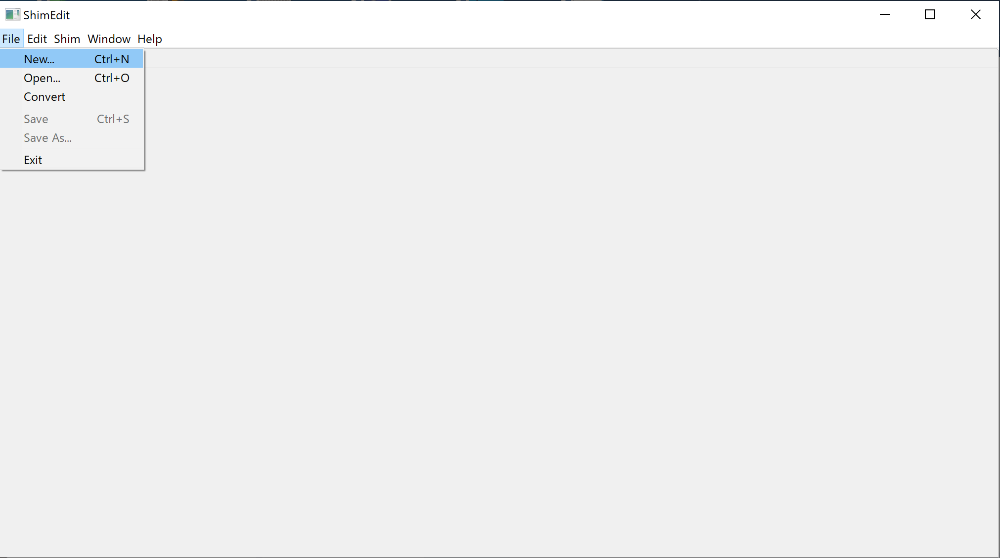 
**figure1. Editor page**
<!--

**figure1. Editor page**

-->

#### <a name="2_1_page">1st page: Setting ComponentSetInfomation</a>

You should input some basic infomation for new SHIM2.0 XML for creating initial component set structure.
When you configure *MasterComponent*, select a tab of *MasterComponent*. In case of configuring *SlaveComponent* or *ComponentSet*, like, select a tab of *SlaveComponent* or *ComponentSet*.

 
**figure2. Setting ComponentSetInfomation**

#### <a name="2_2_page">2nd page: Edit Component Structure</a>

The 2nd page shows the structure of *ComponentSet* that is created based on the settings you inputted at the previous page.

 
**figure3. Edit Component Structure**

If you'd like to add a child component or to delete components, right-click on the target components and select *Add Child ～* or *Delete Item*.

 
**figure4. Edit Component Structure's menu items**

#### <a name="2_3_page">3rd page: Setting AddressSpace Infomation</a>

At this page, input the number of the element such as *AddressSpace* and *SubSpace* that you'd like to create.

 
**figure5. Setting AddressSpace Infomation**

#### <a name="2_4_page">4th page: Setting AddressSpace</a>

The 4th page shows AddressSpaces and SubSpaces.
You can edit the infomation of those elements.
If you'd like to add a new SubSpace or to delete AddressSpace, SubSpace, right-click on the target components and select *Add Child ～* or *Delete Item*.

 
**figure6. Setting AddressSpace**

#### <a name="2_5_page">5th page: Setting Communication Set</a>

Select Communication Set you'd like to create, and configure them.
 
**figure7. Setting Communication Set**

#### <a name="2_6_page">6th page: Cache Infomation</a>

Select *Cache Type*, and configure the cache.
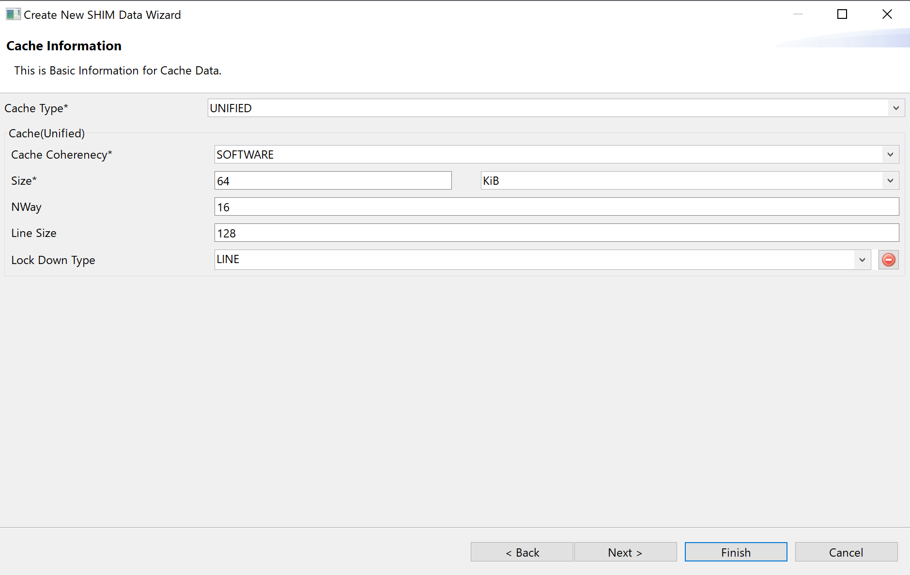 
**figure8. Cache Infomation**

If you select *Data and Instruction* at the *Cache Type* selection, you should configure *Data Cache* and *Instruction Cache*.
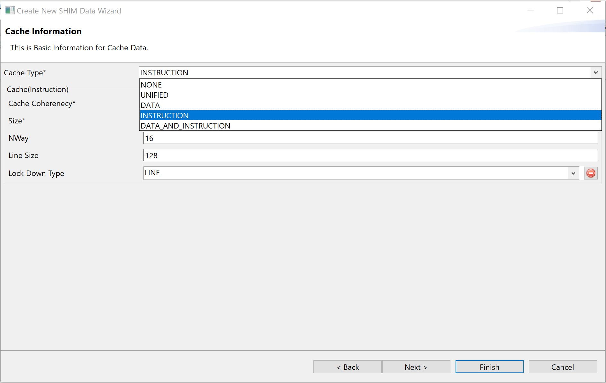 
**figure9. Cache Infomation (Data and Instruction)**

#### <a name="2_7_page">7th page: Setting Infomation of Base AccessType</a>

The 7th page is the final page.You can configure *AccessType* at this page.
The number of *AccessType* is determined by the following formula.

- [the number of *RWType*] × [the number of *AccessByteSize*]

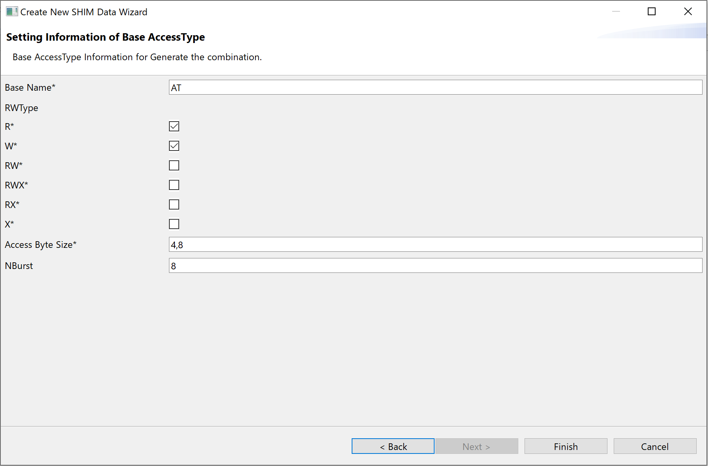 
**figure10. Setting Infomation of Base AccessType**

## <a name="3_load">3.Load SHIM2.0 XML</a>

If you have a SHIM2.0 XML file, you open and edit it.
Click on File and Open, and select SHIM2.0 XML file.

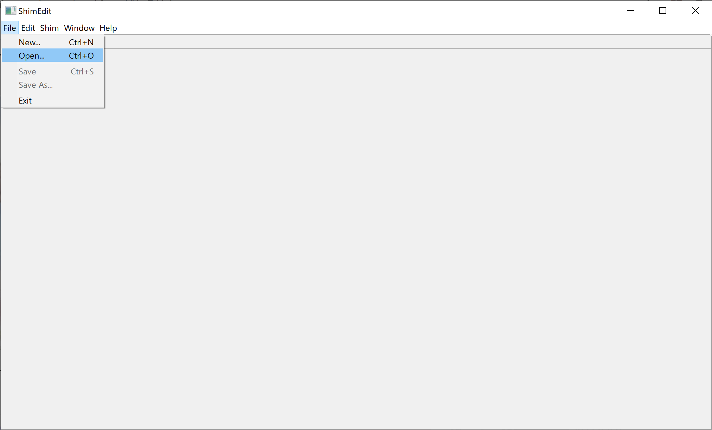 
**figure11. Load SHIM2.0 XML**

 
**figure12. Load SHIM2.0 XML, FileDialog**

## <a name="4_edit">4.Edit SHIM2.0 XML</a>

If you create a new SHIM2.0 XML or open a SHIM2.0 XML file, SHIM2.0 Editor shows some infomation of SHIM2.0 XML.
Introduce about the following typical control by an after section.
- Add Child Elements
- Delete item
- Copy Item
- Paste Item
- Re-number nodes
- Visualization of XML

##### <a name="4_1_add">Add Child Elements</a>

To add an element, you must know which element is its parent element.
Right-click on the element to be belonged in the TreeViewer, you can select *Add Child Element*.

For example, add child *ComponentSet* to the *ComponentSet* in this section.

If you'd like to edit the structure of component, select *Components* tab.
Right-click on the parent *ComponentSet*, select *ComponentSet*.

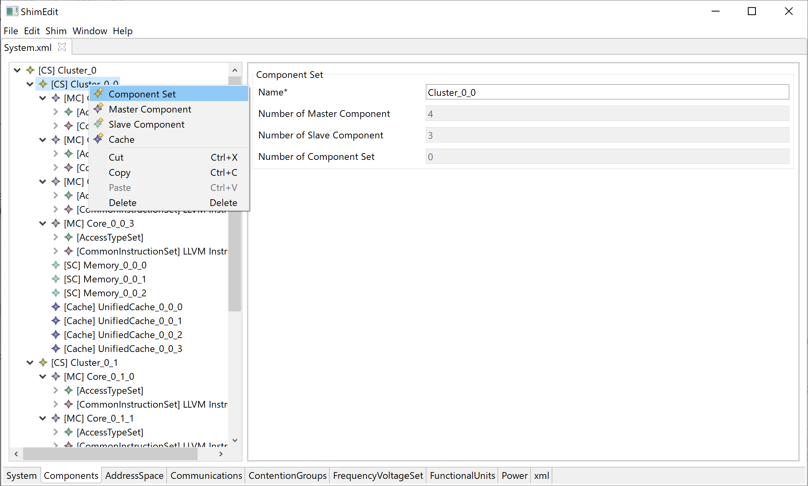 
**figure13. Add Child Component**

 
**figure14. After Add Child Component**

##### <a name="4_2_delete">Delete Item</a>

If you'd like to delete an element, right-click on the target element in Treeviewer and select *Delete*.

 
**figure15. example that Delete Item**

##### <a name="4_3_edit">Edit Element's Paramerer</a>

There are several ways to edit element's parameter(ex. attribute, child elements).

The simplest way is that you select a target element in TreeViewer and edit displayed parameters.
 
**figure16. Edit an element from an element's input panel**

You can also select the target element in TreeViewer and right-click to edit the optional parameters.

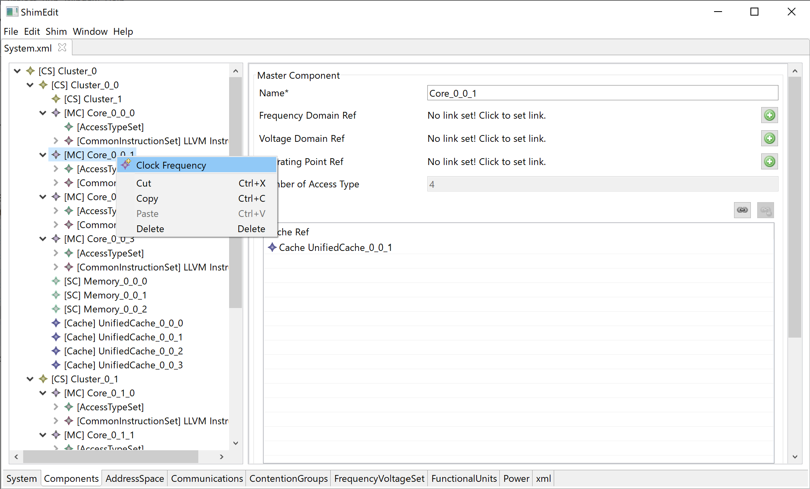 

 
**figure17. Edit an optional element**

##### <a name="4_4_copypaste">Copy & Paste Item</a>

SHIM2.0 Editor supports copy and paste.
To copy the item, you select the item, right-click on it and select *Copy*.

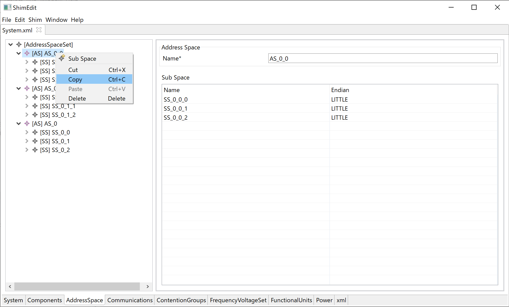 
**figure18. Copy Item(s)**

To paste the item, you select the item that is the parent element of the copy item, right-click on it and select *Paste*.

 
**figure19. Paste Item(s)**

You can paste the item according to the schema of SHIM2.0 XML.

 
**figure20. After Paste item and Overwrite**

##### <a name="4_5_renumber">Re-number nodes</a>

After adding child elements, deleting child elements and so on, you want to assign automatically component numbers.
In this case, click shim, *Re-number nodes* button.

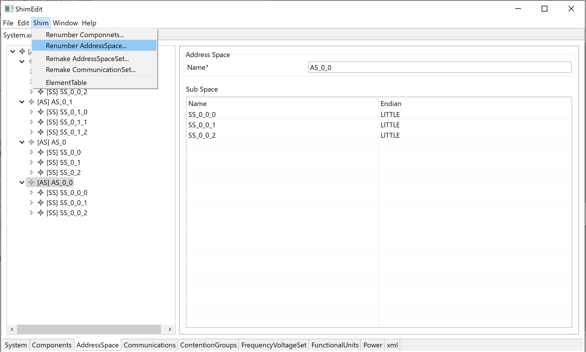 
**figure21. Before _Re-number nodes_**

 
**figure22. After _Re-number nodes_**

##### <a name="4_6_remake">Re-Make AddressSpaceSet(or CommunicationSet)</a>

SHIM2.0 Editor does not create automatically new CommunicationSet or MasterSlaveBindingSet after *Add Child Master(or Slave)Component* and *Paste the Master(or Slave)Component*, because doesn't know whether those are needed.
If you want to create all combinations of AddressSpaceSet or CommunicationSet, click on shim, *Re-Make AddressSpaceSet(or CommunicationSet)*.

 
**figure23. Re-Make AddressSpaceSet(or CommunicationSet)**

##### <a name="4_7_visualize">Visualization of XML</a>
You can check the edited SHIM2.0 XML by XML description with SHIM2.0 Editor.

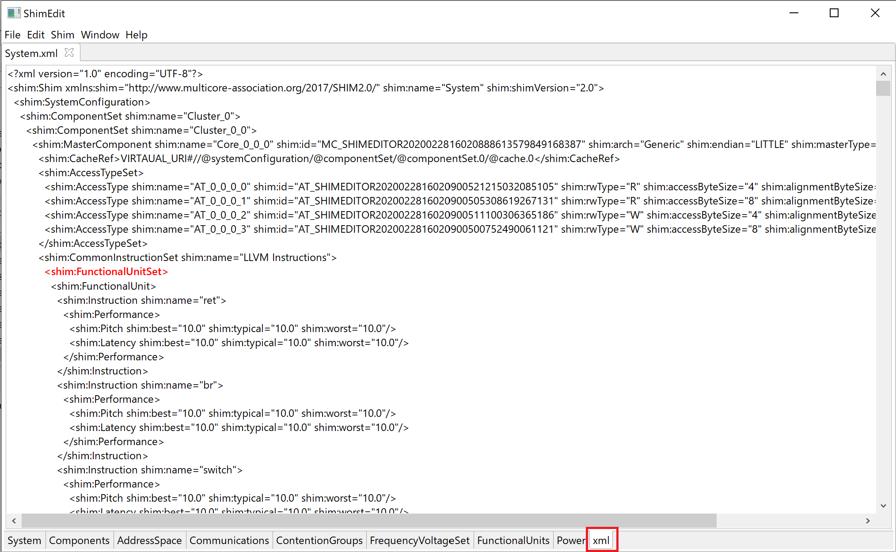 
**figure24. Visualization of XML**

##### <a name="4_8_split">Split output of XML (FunctionalUnitSet)</a>

You can split output of XML (FunctionalUnitSet).
Left-click the red FunctionalUnitSet. The output dialog opens.

 
**figure25. Split output of XML (FunctionalUnitSet)**

 
**figure26. The split output dialog FunctionalUnitSet**

## <a name="5_convert">5.Convert SHIM1.0 XML to SHIM2.0 XML</a>

If you have a SHIM1.0 XML file, you can open it and it is converted SHIM2.0 XML file. Note that you cannot edit the XML of SHIM1.0 as it is. The opened file can be edited as SHIM 2.0 XML.
Click on File and the "Convert", and select SHIM1.0 XML file.

 
**figure27. Convert page**

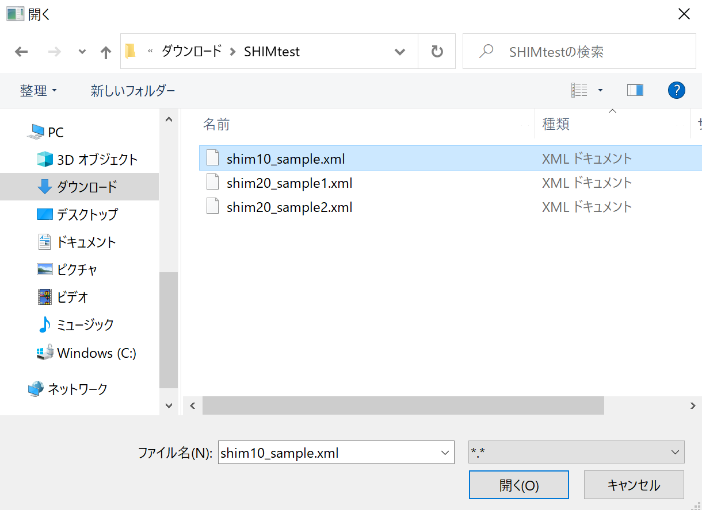 
**figure28. Load SHIM1.0 XML, FileDialog**
