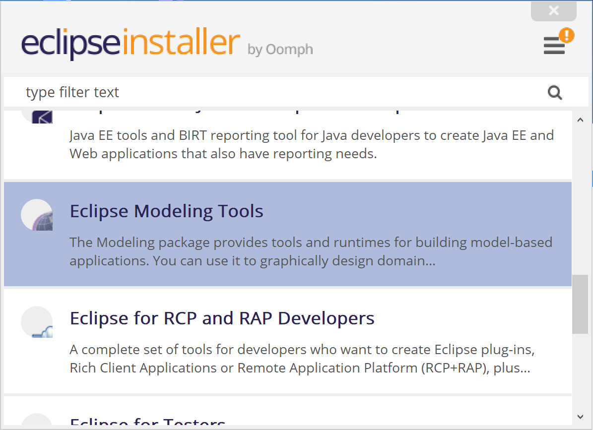
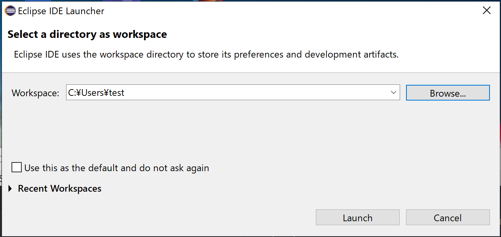
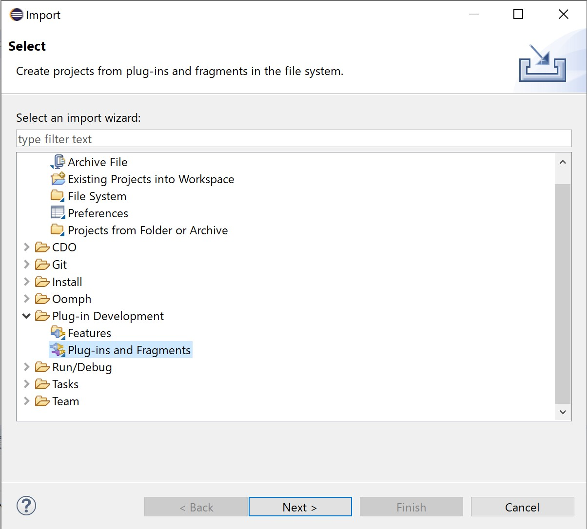
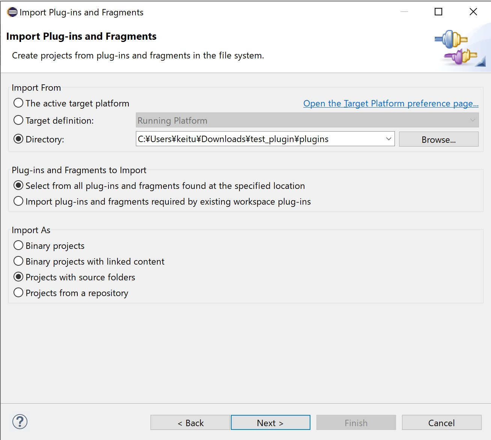
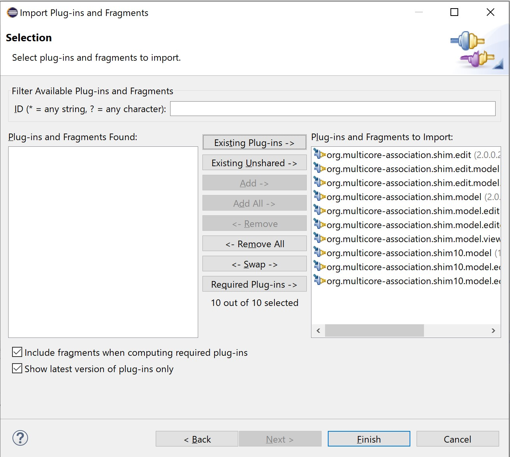

SHIM 2.0 Editor
================

This tool is an Eclipse Plugin-in, which is capable of creating and editing SHIM 2.0 xml.

  1. [Requirement](#requirement)
  2. [Tutorial](#tutorial)
   - 2.1. [Procedures](#procedures)
   - 2.2. [Import the project](#import-the-sample-project)
   - 2.3. [Run the project](#run-the-measurement-process)

----------------

### <a name="requirement">Requirement</a>

To take advantage of this tool, the following settings should be conducted correctly.
- JRE for Java SE 8 or later
- Eclipse IDE 2019-06

The operation was confirmed in the following environment.
- Windows 10
- Java SE Development Kit 13 (Oracle JDK)
- Eclipse IDE 2019-06

----------------

##### How to run the application
The procedure for executing the application is as follows.

Preparing for the Eclipse environment
- Java SE Development Kit13 (Oracle JDK)
    * https://www.oracle.com/java/technologies/javase-jdk13-downloads.html

After installation, please add 'JAVA_HOME' to Environment Variables, and specify the path to the installed JDK.

In addition, please add the path to the bin folder in the JDK installed folder to 'PATH' in Environment Variables.

Preparing for the Eclipse environment
  - Eclipse
    * IDE 2019-06
    * https://www.eclipse.org/downloads/download.php?file=/oomph/epp/2019-06/R/eclipse-inst-win64.exe

Click the link above and click the "Download" link to download the installer.

 

When the downloaded installer file is executed, a screen for selecting the product to be installed is displayed. Click "Eclipse Modeling Tool" in the list.

 

The installation destination and Java environment selection screen is displayed. Check that the appropriate values are set, and click "INSTALL". The default installation location is under the user directory.

### <a name="tutorial">Tutorial</a>

##### <a name="procedures">Procedures</a>
Download the source code from [shim2]((https://github.com/openshim/shim2/tree/master/sources)). The file can be tar.gz(SHIM2.0editor.tar.gz) format.

##### <a name="import-the-sample-project">Import the project</a>

Execute the installed "Eclipse Modeling 2019-06". A screen for selecting the location of the workspace is displayed. Set the location where you want to place the workspace, and then click "Launch".

 

Click "Import" in the "File" menu.

 

The wizard launches and displays a selection page. In the "Plug-in Development" category
Select "Plug-ins and Fragments" and click "Next".

 

A screen for specifying the directory to import from is displayed. Select "Import Form" and then select the directory.

 

The "Projects" list is updated. Make sure that the project to be imported is as shown below, and select "Finish" to deploy the project with Eclipse.

 

##### <a name="run-the-measurement-process">Run the project</a>

Projects listed in the Model Explorer list
Expand "org.multicore_association.shim.edit" and select "ShimEdit.product" in it.

With "ShimEdit.product" selected, select "Run As" in the "Run" menu, and then select "Eclipse Application".

 

You can see that the application is running and a window is displayed.

 

If you are having trouble setting up Run, you can configure Run Configurations yourself.

Select "Run Configurations" in the "Run" menu.
 

After opening Run Configurations, select " Plugin-ins" . Here, it is possible to automatically set the Configurations of the target file. After selecting the target file, select " Validate Plug-ins"  and then " Run". Then you can see that the application is running and a window is displayed.
 

----------------
