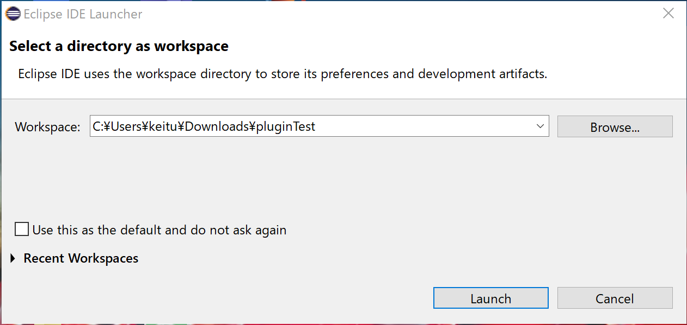
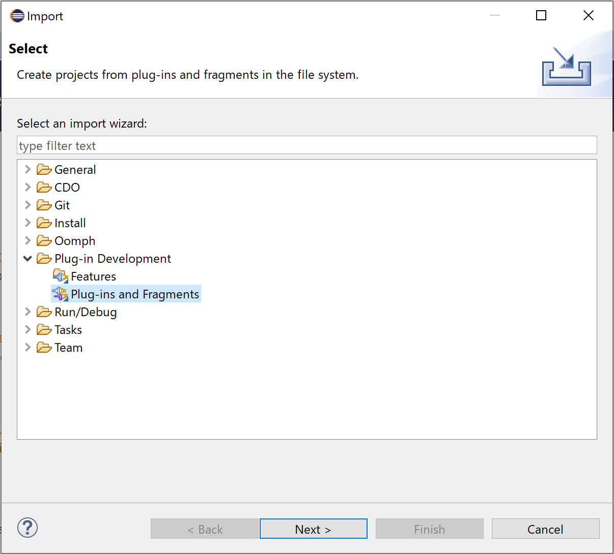
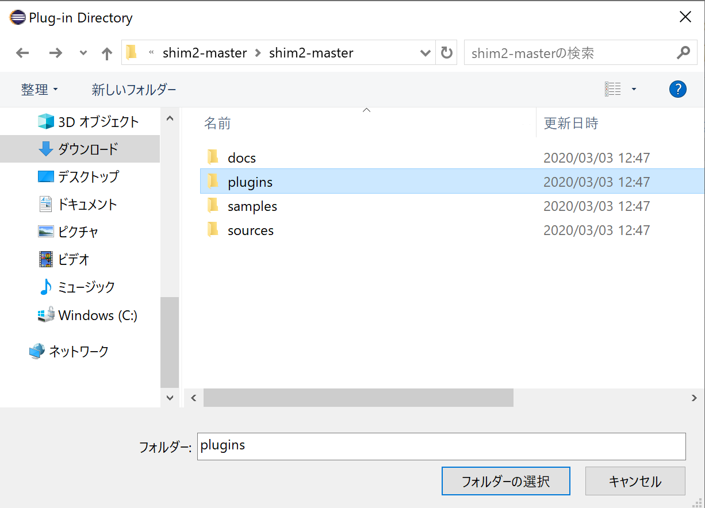
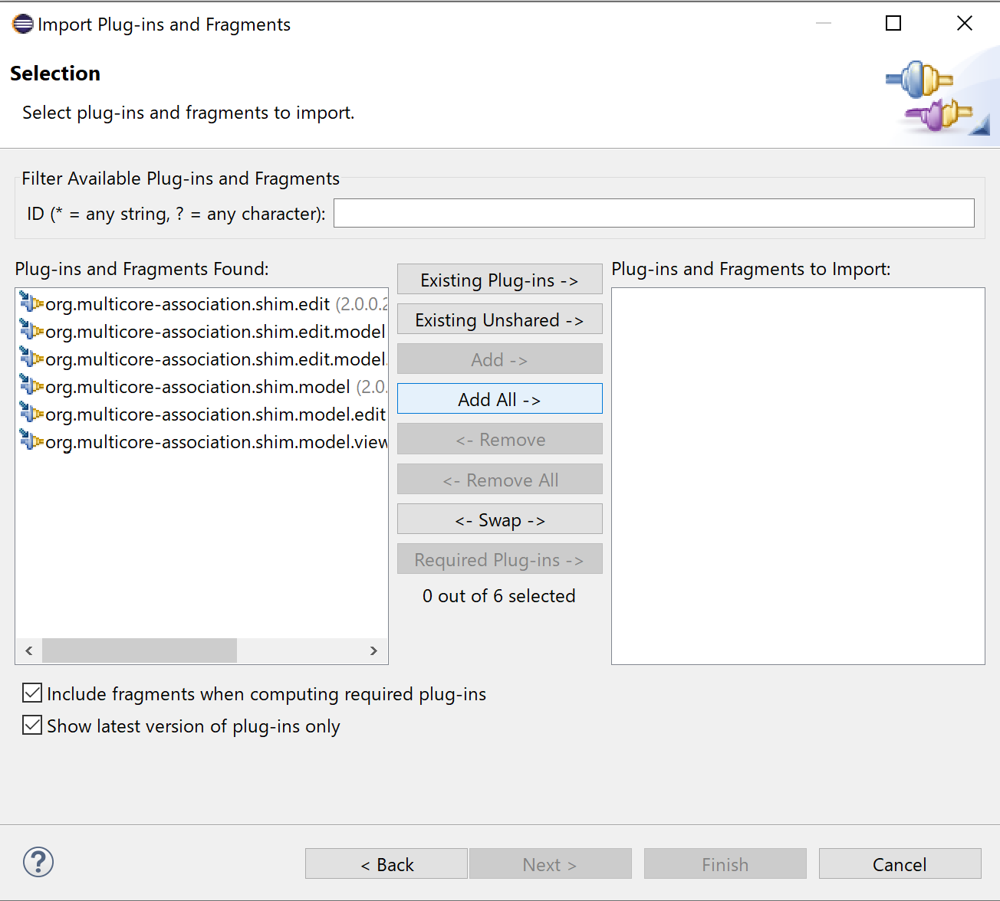
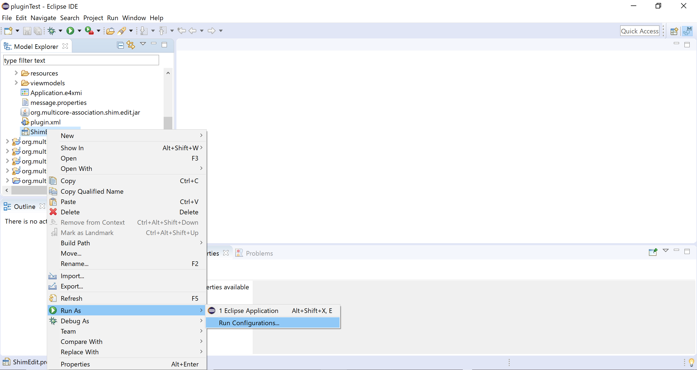
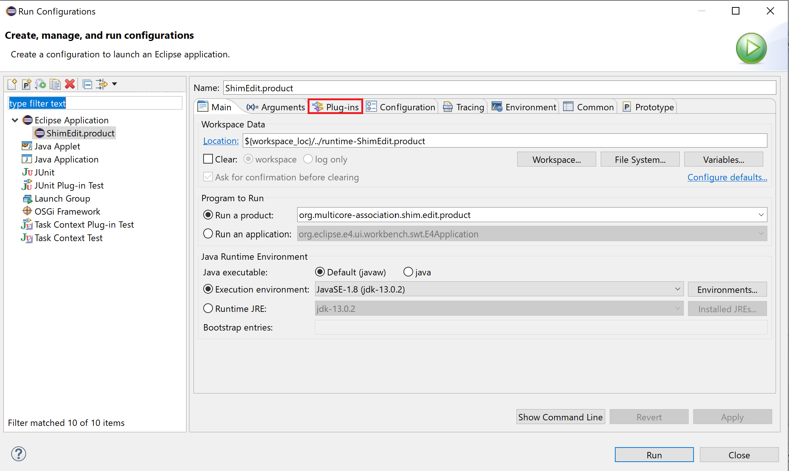
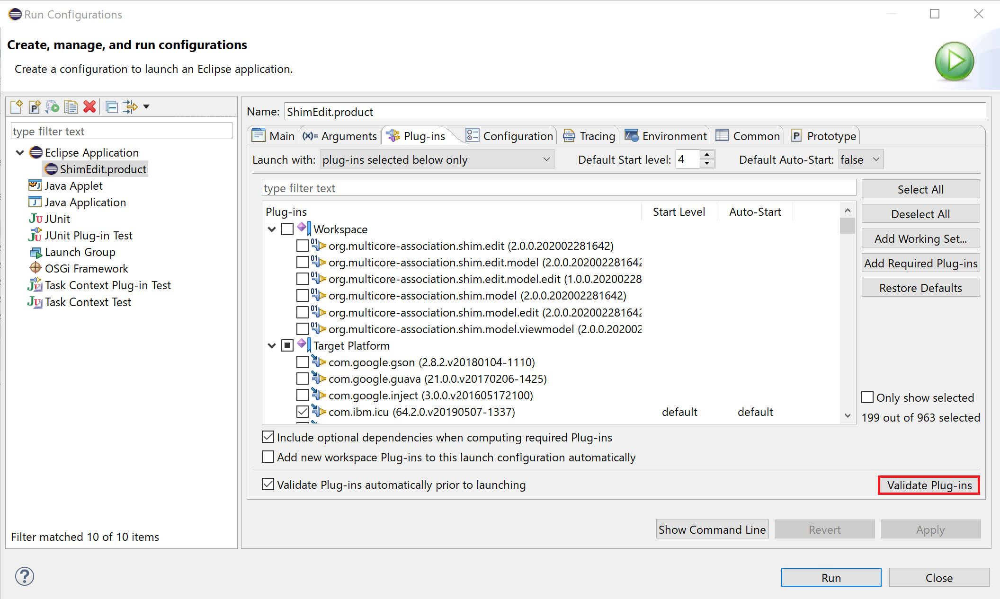
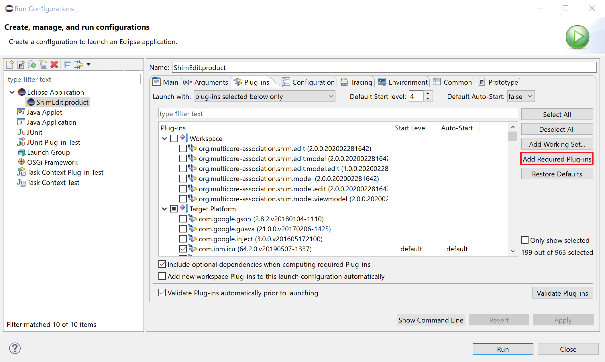
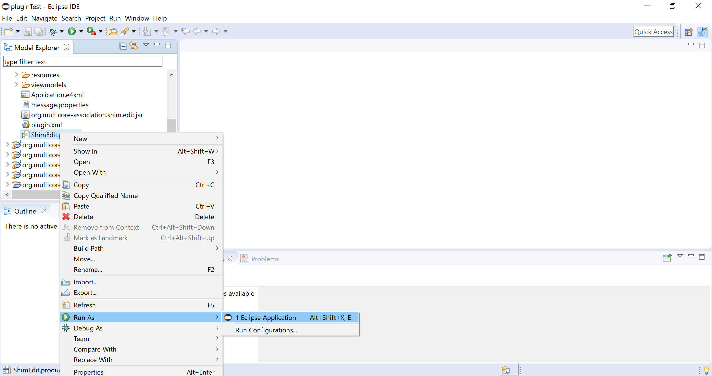

SHIM 2.0 Editor
================

This tool is an Eclipse Plugin-in, which is capable of creating and editing SHIM 2.0 xml.

  1. [Requirement](#requirement)
  2. [Tutorial](#tutorial)
   - 2.1. [Procedures](#procedures)
   - 2.2. [Import the project from plugins](#import-the-sample-project)
   - 2.3. [Run the project](#run-the-measurement-process)

----------------

### <a name="requirement">Requirement</a>

To take advantage of this tool, the following settings should be conducted correctly.
- JRE for Java SE 8 or later
- Eclipse IDE 2019-06

The operation was confirmed in the following environment.
- Windows 10
- Java SE Development Kit 13 (Oracle JDK)
- Eclipse IDE 2019-06

----------------
The procedure for executing the application is as follows.

Preparing for the Eclipse environment
- Java SE Development Kit13 (Oracle JDK)
    * https://www.oracle.com/java/technologies/javase-jdk13-downloads.html

After installation, please add 'JAVA_HOME' to Environment Variables, and specify the path to the installed JDK.

In addition, please add the path to the bin folder in the JDK installed folder to 'PATH' in Environment Variables.

Preparing for the Eclipse environment
  - Eclipse
    * IDE 2019-06
    * https://www.eclipse.org/downloads/download.php?file=/oomph/epp/2019-06/R/eclipse-inst-win64.exe

Click the link above and click the "Download" link to download the installer.

 

When the downloaded installer file is executed, a screen for selecting the product to be installed is displayed. Click "Eclipse Modeling Tool" in the list.

 

The installation destination and Java environment selection screen is displayed. Check that the appropriate values are set, and click "INSTALL". The default installation location is under the user directory.

### <a name="tutorial">Tutorial</a>

#### <a name="procedures">Procedures</a>
Download the plugins from [plugins](https://github.com/openshim/shim2/tree/master/plugins).

#### <a name="import-the-sample-project">Import the project from plugins</a>

Execute the installed "Eclipse Modeling 2019-06". A screen for selecting the location of the workspace is displayed. Set the location where you want to place the workspace, and then click "Launch".

 

Click "Import" in the "File" menu.

 

The wizard launches and displays a selection page. In the "Plug-ins and Fragments" category
Select "Plug-ins and Fragments" and click "Next".

 

A screen for specifying the directory to import from is displayed. Select "Directory" and then select the "plugins" of downloaded file. After selecting "plugins", select "Next"

 

*Plug-ins and Fragments* list is updated. Make sure that the project to be imported is as shown below. Select "Add all" to import *Plug-ins and Fragments* with Eclipse and "Finish".

 

#### <a name="run-the-measurement-process">Run the project</a>

#### Required Plug-ins

When launching the SHIM2.0 editor from *Plug-ins and Fragments*, you need to add the plugins needed for your environment. This is usually stored in the *feature.xml file*, but *feature.xml file* cannot be plugged in (note that it is included in the [sources](https://github.com/openshim/shim2/tree/master/source)). Therefore, you need to manually add the required plugins to your environment in the following way.

Projects listed in the Model Explorer list
Expand "org.multicore_association.shim.edit" and select "ShimEdit.product" in it.

With "ShimEdit.product" selected, select "Run As" in the "Run" menu, and then select "Run Configuratations".

 

A screen for setting the configuratations of the project is displayed. Select "Plug-ins"

 

This screen allows you to manually set the plugins required for your environment. Select "Validate Plug-ins" to see a list of plugins needed for your environment.

 

By selecting "Add Required Plug-ins", you can automatically add the required plugins for your environment. Select "Add Required Plug-ins" and select "Apply" to complete the required plugin settings. You can also start the SHIM2.0 editor from this screen by selecting "Apply" and selecting "Run".

 

#### How to run the application

Projects listed in the Model Explorer list Expand "org.multicore_association.shim.edit" and select "ShimEdit.product" in it.                               
With "ShimEdit.product" selected, select "Run As" in the "Run" menu, and then select "Eclipse Application".

 

You can see that the application is running and a window is displayed.

 

----------------
